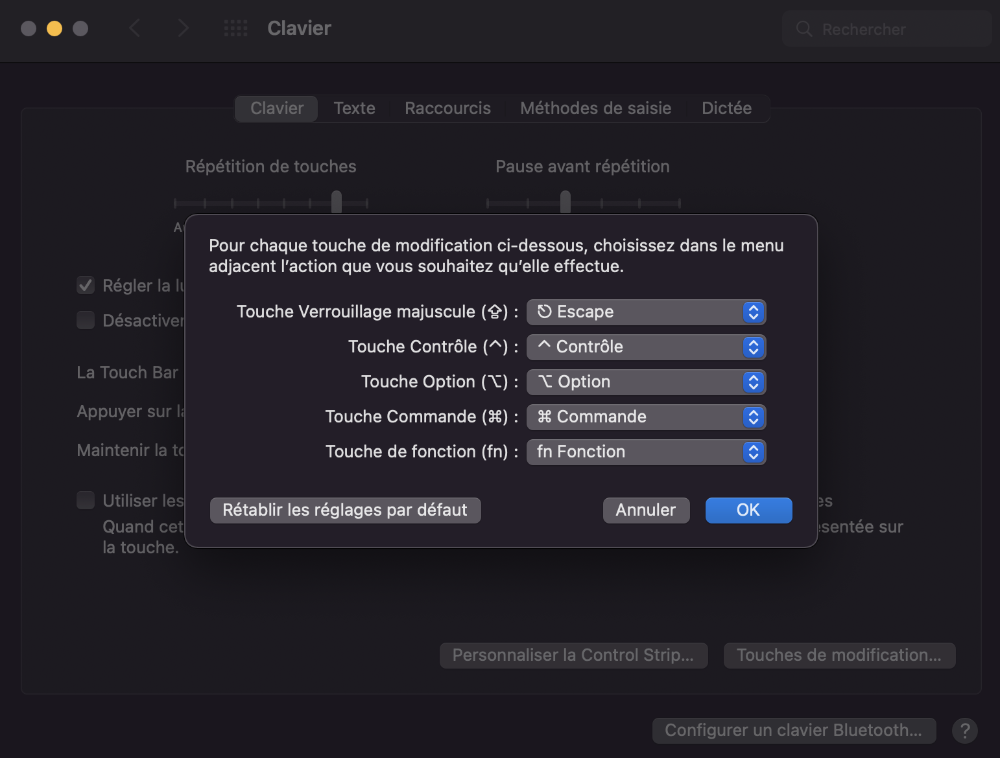

# Visual Studio Code Configuration

Modifications made to `settings.json` and `keybindings.json` files to customize keyboard shortcuts and settings in Visual Studio Code.

## Key Modifications in `settings.json`

- **Color Theme**: Set to "Monokai".
- **Minimap**: Disabled for a cleaner interface.
- **Auto Formatting**: Enabled on save.
- **Vim Key Bindings**: Configured for navigating between window groups and editors.

## Keyboard Shortcuts

Here are the defined keyboard shortcuts and their actions:
| Raccourci                          | Action                                                       | Contexte                                         |
|------------------------------------|-------------------------------------------------------------|--------------------------------------------------|
| Leader + v                         | Divise verticalement la fenêtre courante                   | Mode normal de Vim                               |
| Leader + s                         | Divise horizontalement la fenêtre courante                  | Mode normal de Vim                               |
| Leader + h                         | Focalise le groupe de fenêtres à gauche                     | Mode normal de Vim                               |
| Leader + j                         | Focalise le groupe de fenêtres en dessous                   | Mode normal de Vim                               |
| Leader + k                         | Focalise le groupe de fenêtres au-dessus                    | Mode normal de Vim                               |
| Leader + l                         | Focalise le groupe de fenêtres à droite                     | Mode normal de Vim                               |
| Shift + H                                  | Passe à l'éditeur précédent                                  | Mode normal de Vim                               |
| Shift + L                                  | Passe à l'éditeur suivant                                    | Mode normal de Vim                               |
| Ctrl + E                         | 	afficher la barre latérale de navigation de fichier                   | 	
| n                         | 	nouveau fichier dans l'explorateur                   | 	Contexte : filesExplorerFocus && !inputFocus
| r                         | 	renommer fichier dans l'explorateur                   | 	Contexte : filesExplorerFocus && !inputFocus
| Shift + N                         | 	nouveau dossier dans l'explorateur                  | 	Contexte : explorerViewletFocus
| d                         | 	supprimer fichier dans l'explorateur                  | 	Contexte : filesExplorerFocus && !inputFocus
| cc                         | 	changes a complete line                  | 	Mode normal de Vim
| C                         | 	changes from the cursor until the end on the line                 | 	Mode normal de Vim
| gi                         | 	go back to the last place where you made a change                 | 	Mode normal de Vim


## Switch Caplocks button to ESC

### On Ubuntu
Type in the terminal:
```
sudo apt install gnome-tweaks
```
Launch it via:
```
gnome-tweaks
```
* go to “Keyboard & Mouse” tab, and click on “Additional Layout Options”
* Inside “Caps Lock Behavior” choose “Make Caps Lock an additional Esc”

### On MACOs
* Got to Preference -> Keyboard -> "Shortcuts" -> "modify keys" -> set Maj key as ESC


     
     
 * In Preference -> Keyboard . Remove shortkey using C^-Up and C^-Down
